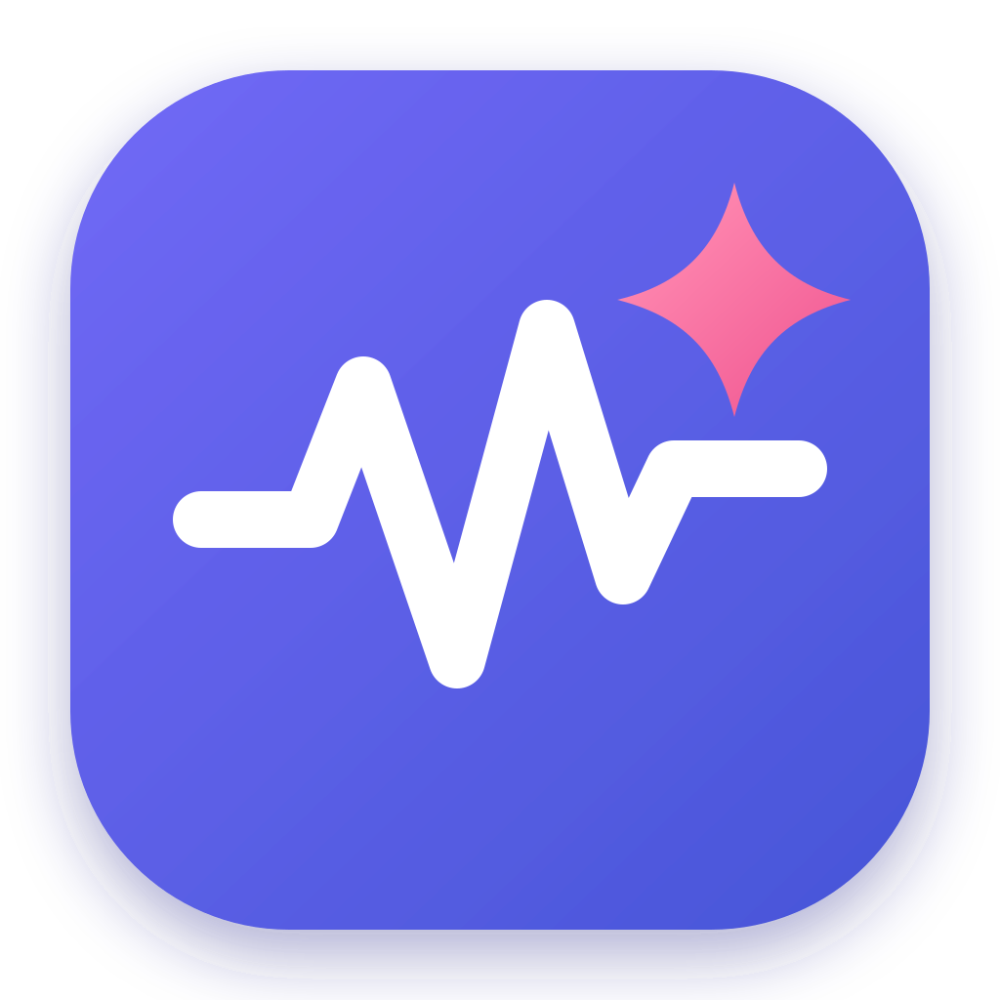

<div align="center">
  

# Agent Monitor

面向 Claude Code 与 Codex CLI 的本地单轮停止声音提醒工具。

[](https://github.com/yanachen1314/Agent-Monitor)
[](https://github.com/yanachen1314/Agent-Monitor)
[](https://gitee.com/yanachen1314/agent-monitor)
[](./LICENSE)
[](https://www.electronjs.org/)
[](https://vuejs.org/)

</div>

## 项目简介

Agent Monitor 是一个运行于 Windows 和 macOS 的 Electron 托盘应用。它通过 Claude Code
与 Codex CLI 的官方 `Stop` Hook 感知一轮 Agent 执行停止，并及时播放本地提示音，让你在
处理其他工作时不必反复查看终端。

提醒仅表示当前一轮 Agent 执行已经停止，不代表整个任务或目标已经完成。

## 功能特性

- 同时监控 Claude Code 与 Codex CLI。
- 支持默认提示音和独立的自定义提示音。
- 支持音量调整、提示音试听和恢复默认音频。
- 支持启用、检测、预览及修复 Stop Hook。
- 支持全局暂停提醒，不影响 Stop 事件接收。
- 支持开机自动启动和关闭窗口后驻留系统托盘。
- 展示最近一次提醒与近期活动。
- 所有监听、状态处理和音频播放均在本地完成。

## 技术栈

- Electron 43
- Vue 3
- TypeScript
- electron-vite
- Less
- Vitest
- electron-builder

## 快速开始

请先安装 Node.js 和 npm，然后执行：

```powershell
git clone https://github.com/yanachen1314/Agent-Monitor.git
Set-Location Agent-Monitor\AgentMonitorElectron
npm install
npm run dev
```

也可以从 Gitee 克隆：

```powershell
git clone https://gitee.com/yanachen1314/agent-monitor.git
Set-Location agent-monitor\AgentMonitorElectron
npm install
npm run dev
```

## 使用说明

1. 启动 Agent Monitor 并进入“设置”页面。
2. 为 Claude Code 或 Codex CLI 配置 Stop Hook。
3. 启用需要监控的 CLI，并选择默认或自定义提示音。
4. 保持应用运行或最小化至系统托盘。
5. Agent 单轮停止后，应用会播放提示音并更新最近活动。

## 开发与检查

所有开发命令均在 `AgentMonitorElectron` 目录执行：

```powershell
npm run dev
npm run typecheck
npm run lint
npm test
npm run format:check
npm run build
```

## 构建安装包

Windows NSIS 安装包：

```powershell
npm run build:win
```

macOS DMG 安装包：

```powershell
npm run build:mac
```

构建产物默认输出到 `AgentMonitorElectron/release/`。

## 项目结构

```text
Agent-Monitor/
├── AgentMonitorElectron/
│   ├── resources/        # 应用图标和内置音频
│   ├── src/
│   │   ├── hook/         # Stop Hook 客户端
│   │   ├── main/         # Electron 主进程
│   │   ├── preload/      # 安全的渲染进程桥接
│   │   ├── renderer/     # Vue 用户界面
│   │   └── shared/       # 共享类型与 IPC 通道
│   └── tests/            # 自动化测试
├── LICENSE
└── README.md
```

## 安全与隐私

- Renderer 禁用 Node.js，并启用 `contextIsolation` 和沙箱。
- Preload 仅向界面暴露固定白名单 API。
- Hook 仅连接本机 `127.0.0.1`，并使用当前进程生成的随机 Token。
- 不记录或传输 Prompt、完整回复、Transcript 或用户代码。
- Hook 调用失败时正常退出，不影响 Claude Code 或 Codex CLI 的使用。
- GitHub 与 Gitee 入口只能打开应用内预设的固定仓库地址。

## 开源协议

本项目基于 [MIT License](./LICENSE) 开源。
